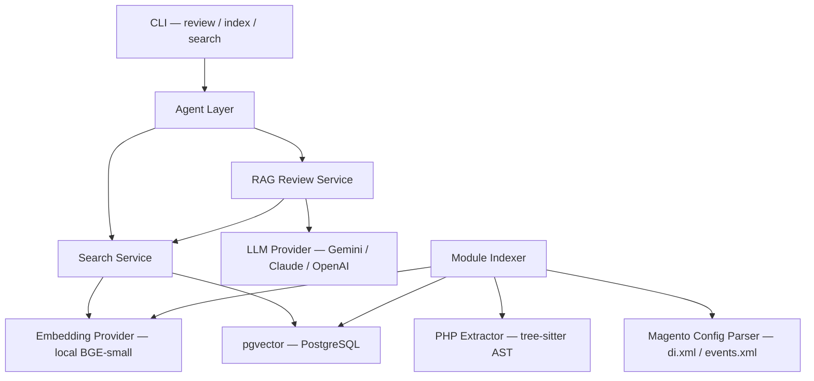

# Mage Audit

**AI-powered architecture auditor for Magento codebases.**

Most AI code review tools (CodeRabbit, Greptile, Copilot) treat code as generic text. They don't understand the architectural conventions of complex frameworks like Magento — observers, plugins, dependency injection, layout XML, area-scoped configuration.

Mage Audit is built differently. It combines a universal AI code analysis engine with framework-specific knowledge layers, starting with Magento 2.

## Key Features

- **RAG-powered code review** — retrieves relevant code from indexed codebase before analysis, giving project-specific recommendations instead of generic advice
- **Magento-aware** — understands plugins, observers, preferences, DI configuration from `di.xml` and `events.xml`
- **Multi-strategy retrieval** — searches by code similarity, class/method names, and dependencies
- **Structured output** — findings with severity, category, line numbers, and concrete suggestions
- **CLI interface** — three commands: `review`, `index`, `search`

## Evaluation Results

Tested on a PHP file with 13 known issues (SQL injection, architecture violations, missing error handling, etc.):

| Metric                      | Simple Mode | RAG Mode |
| --------------------------- | ----------- | -------- |
| Issues detected             | 54%         | **69%**  |
| Project-specific references | 1           | **10**   |
| Input tokens                | 637         | 1,495    |

RAG mode finds **15 percentage points more issues** and provides recommendations that reference specific files from the project ("consistent with `OrderProcessor.php` from your codebase") instead of generic advice.

## Architecture



Layered design:
- **Core (`src/core/`)** — Universal AI engine: LLM providers, embeddings, AST parsing, agent orchestration. Framework-agnostic.
- **Languages (`src/languages/`)** — Language-specific: PHP parsing via tree-sitter.
- **Frameworks (`src/frameworks/`)** — Framework-specific: Magento config parsing, module indexing.

Adding a new framework (Symfony, Laravel) reuses ~80% of the codebase.

## Quick Start

### Prerequisites

- Python 3.12+
- Docker (for PostgreSQL + pgvector)
- Google AI Studio API key (free)

### Setup

```bash
git clone https://github.com/Aquarvin/mage-audit.git
cd mage-audit

# Install dependencies
uv sync --extra dev --extra ai --extra parsing

# Start databases
docker compose up -d

# Configure
cp .env.example .env
# Edit .env: add your GOOGLE_API_KEY
```

### Usage

**Review a PHP file (Simple mode):**
```bash
uv run mage-audit review path/to/file.php
```

**Index a Magento module:**
```bash
uv run mage-audit index path/to/module --name my-module
```

**Search indexed code:**
```bash
uv run mage-audit search my-module "order processing logic"
uv run mage-audit search my-module "plugin for save" --code
```

**Review with project context (RAG mode):**
```bash
uv run mage-audit review path/to/file.php --repo my-module
```

## Tech Stack

- **Python 3.12+** with `uv` for dependency management
- **FastAPI** for HTTP API
- **PostgreSQL 16 + pgvector** for vector storage and semantic search
- **Redis** for caching and job queues
- **tree-sitter** for AST-based PHP code analysis
- **sentence-transformers (BGE-small)** for local embeddings (no API cost)
- **Google Gemini** as LLM provider (swappable via provider abstraction)
- **Typer + Rich** for CLI with formatted output
- **GitHub Actions** for CI (lint + test)

## Project Structure
src/
├── core/                    # Universal AI Engine
│   ├── llm/                # LLM provider abstraction (Gemini, Claude, OpenAI, Ollama)
│   ├── embeddings/         # Embedding provider abstraction (local, API-based)
│   ├── agent/              # ReviewService, RAGReviewService, SearchService
│   └── config.py           # Pydantic Settings
├── languages/php/          # PHP parsing via tree-sitter
├── frameworks/magento/     # Magento config parser + module indexer
├── api/                    # FastAPI endpoints
└── cli/                    # CLI via Typer

## Documentation

- [Architecture](docs/ARCHITECTURE.md) — system design with diagrams
- [Decisions](docs/DECISIONS.md) — architectural decision records (ADRs)
- [Roadmap](docs/ROADMAP.md) — development progress

## Cost

Runs entirely on free tiers:
- **LLM**: Google Gemini free tier (1,500 requests/day)
- **Embeddings**: Local BGE-small model (no API calls)
- **Database**: Local PostgreSQL + pgvector via Docker
- **CI**: GitHub Actions free tier

## License

MIT — see [LICENSE](LICENSE).