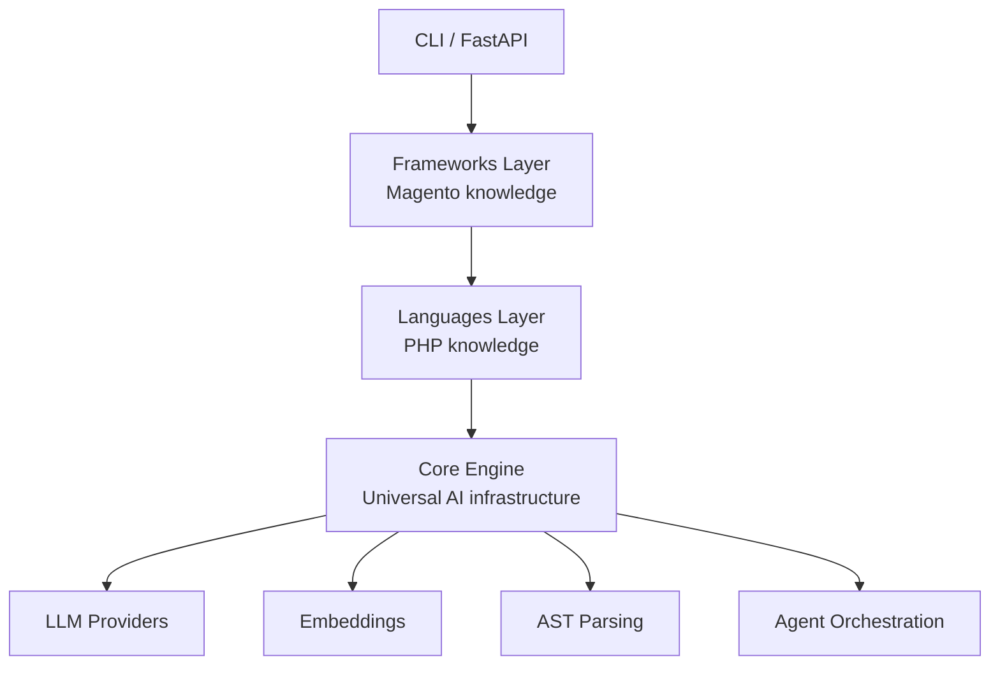

# Architecture

## Overview

Mage Audit is a layered AI system for analyzing Magento codebases. The layers are organized by **specificity** — from universal (works for any code) to specific (Magento-only logic).

## Layers

## Core Engine (`src/core/`)

Framework-agnostic. Doesn't know about PHP, Magento, or any specific domain.

### LLM Providers (`src/core/llm/`)

Abstraction over multiple LLM APIs (Gemini, Claude, OpenAI, local Ollama). All providers implement the same `LLMProvider` interface, so switching providers is a single environment variable.

### Embeddings (`src/core/embeddings/`)

Same abstraction pattern for embedding models. Supports local models via `sentence-transformers` and remote APIs.

### Parsing (`src/core/parsing/`)

Tree-sitter based AST extraction. Tree-sitter supports 40+ languages, so this layer is language-agnostic.

### Agent (`src/core/agent/`)

Agent orchestration: the loop that calls LLMs, executes tools, observes results, and decides next steps.

## Languages Layer (`src/languages/`)

Language-specific logic. Currently: PHP only.

### PHP (`src/languages/php/`)

PHP-specific patterns: namespace handling, composer.json parsing, type system understanding.

## Frameworks Layer (`src/frameworks/`)

Framework-specific knowledge. Currently: Magento only.

### Magento (`src/frameworks/magento/`)

Magento-specific patterns:
- Observers and events
- Plugins (around/before/after)
- Preferences and DI configuration
- Layout XML processing
- Area-scoped configuration (frontend/adminhtml/global)
- Module structure conventions

## Interfaces

### CLI (`src/cli/`)

Command-line interface for local use and CI integration.

### API (`src/api/`)

FastAPI HTTP API for GitHub App integration and web UI.

## Decision Records

Major architectural decisions are documented as ADRs in [DECISIONS.md](DECISIONS.md).